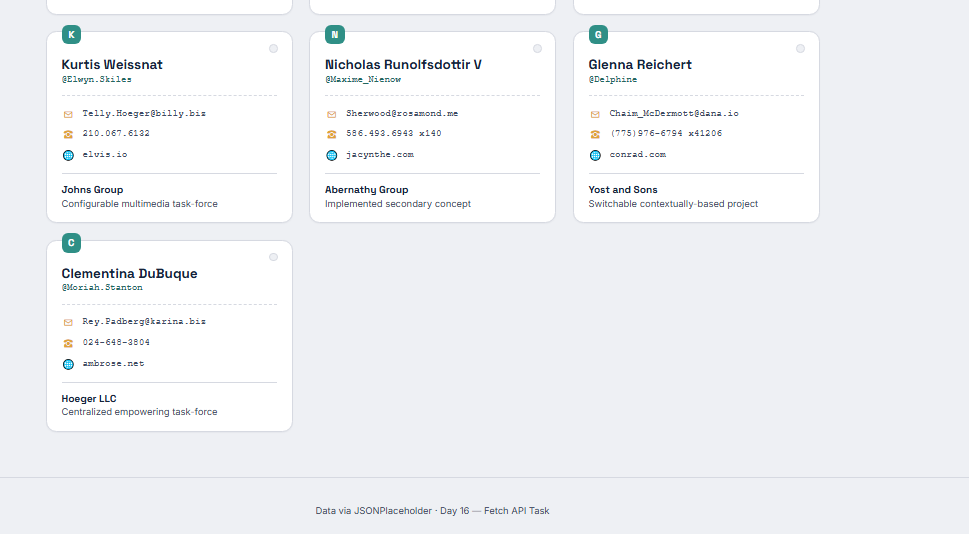

# Day 16 — User Directory Application (Fetch API)

A responsive user directory built with **HTML, CSS, and vanilla JavaScript**, using the Fetch API to pull live data from [JSONPlaceholder](https://jsonplaceholder.typicode.com/users) and render it as styled "index card" style user cards.

## Objective

Learn how to retrieve data from external APIs using the Fetch API, and gain practical experience working with asynchronous requests, handling API responses, and dynamically displaying data on a webpage.

## Features

- **Live data fetching** — `fetch()` + `async/await` pulls user data from a public REST API on page load.
- **Three UI states**
  - **Loading** — animated skeleton cards while the request is in flight.
  - **Empty** — friendly message if the API returns no users.
  - **Error** — clear message + a "Try again" button if the request fails, handled with `try...catch`.
- **DOM-generated cards** — no raw JSON is shown on the page; each user's name, username, email, phone, website, and company are rendered into a card via DOM manipulation.
- **Responsive grid layout** — CSS Grid so cards reflow from a single column on mobile up to multiple columns on desktop.
- **Reload control** — a header button (and a retry button in the error state) that re-runs the fetch.

## Files

| File | Purpose |
|---|---|
| `index.html` | Page structure: header, loading/error/empty states, user grid container |
| `style.css` | All styling — theme, card design, skeleton animation, responsive rules |
| `script.js` | Fetch logic, state management, and card rendering |
| `README.md` | Project documentation |

## How to Run

No build step needed — it's plain HTML/CSS/JS.

1. Open `index.html` directly in a browser, **or**
2. Serve the folder locally using Live Server (VS Code extension), **or**
3. Run a local server:
   ```bash
   python3 -m http.server 8000
   ```

## Screenshots

### Loading State


### Cards / Data


### Remaining Cards


## Git Workflow

This repository follows standard Git branching and commit conventions used in professional development teams:

**Branch Naming**
- `feature/<name>` — for new features (e.g. `feature/fetch-user-directory`)
- `bugfix/<name>` — for bug fixes (e.g. `bugfix/error-state-handling`)
- `docs/<name>` — for documentation updates (e.g. `docs/readme-update`)

**Commit Conventions**
This project follows [Conventional Commits](https://www.conventionalcommits.org):
- `feat:` — a new feature (e.g. `feat: add loading and error states`)
- `fix:` — a bug fix (e.g. `fix: handle failed fetch requests`)
- `docs:` — documentation changes (e.g. `docs: update project structure`)

**Merge Process**
- Work is done on feature/bug-fix branches, never directly on `main`.
- Changes are submitted via pull requests and reviewed before merging.
- Merge conflicts, when they occur, are resolved carefully to ensure all changes are preserved and application functionality remains intact.
-
